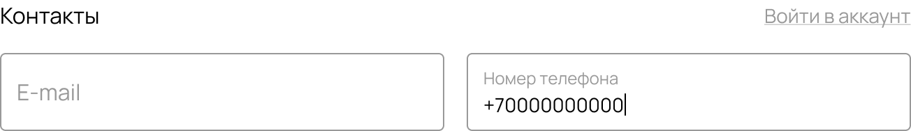

# 02 — CheckoutContactForm

| | |
|---|---|
| **Figma node** | `1:13461` |
| **Size** | 652×94 |
| **Source of truth** | `packages/theme-base/blocks/CheckoutContactForm/` + `packages/storefront/checkout/sections/ContactSection.tsx` |
| **Status** | 🟡 6 fixes applied; floating-label TODO |
| **Last review** | 2026-04-28 |

## Side-by-side

| Figma | Live |
|---|---|
|  | _capture pending_ |

## Figma tokens (`figma-tokens/CheckoutContactForm.json`)

```yaml
Контакты (FRAME 652×94, VERTICAL gap 16)
  Заголовок (FRAME 652×22, HORIZONTAL SPACE_BETWEEN gap 15)
    Контакты (TEXT 72×22, Manrope 16/400 lh 21.86, color #000000)
    Войти в аккаунт (TEXT 105×19, Manrope 14/400 lh 19.12, color #999999, UNDERLINED)
  Frame (FRAME 652×56, HORIZONTAL gap 16)
    E-mail (FRAME 318×56, radius 4, fill #ffffff, border #999999/1, padding 0/12/0/12)
      Empty: только placeholder "E-mail" (Manrope 16/400, color #999999)
    Номер телефона (FRAME 318×56, radius 4, fill #ffffff, border #999999/1, padding 0/12/0/12)
      Filled state: label "Номер телефона" (Manrope 12/400 #999999, top) + value "+70000000000" (Manrope 14/400 #000000)
```

## Gaps (Figma vs prior code)

| # | Aspect | Figma | Prior code | Action |
|---|---|---|---|---|
| 1 | Border color | `#999999` | `#e5e5e5` (я ошибочно осветлил в предыдущем проходе) | **Revert** Rose `--color-input-border` → `#999999` |
| 2 | Field padding | `px-3` (12px) | `px-4` (я ошибочно расширил) | **Revert** все checkout fields → `px-3` |
| 3 | Heading font | **Manrope** (body font) 16/400 | `var(--font-heading)` = Comfortaa в Rose | Heading → `var(--font-body)` |
| 4 | authLink underline | always | `hover:underline` only | `underline underline-offset-2 hover:no-underline` |
| 5 | authLink color | `#999999` (muted) | `var(--color-link)` (Rose link = `#000000`) | → `var(--color-muted)` |
| 6 | Fields gap | 16px | `gap-3` (12px) | `gap-3` → `gap-4` |
| 7 | **Label/placeholder UX** | Floating label (label hides when empty, animates on focus/value) | Static label always | **TODO** separate iter |

## Fix plan

1. ✅ `packages/theme-rose/tokens.json` → `input-border: #999999`
2. ✅ `CheckoutContactForm.classes.ts` → heading font-body, authLink underline+muted, fields `gap-4`, field `px-3`
3. ✅ `CheckoutDeliveryForm.classes.ts` → heading font-body, fields/fieldRow2 `gap-4`, field `px-3`, searchIcon `right-3`
4. ✅ `ContactSection.tsx` → wrapper `gap-4`, both fields `px-3`
5. ✅ `DeliverySection.tsx` → wrapper + grid `gap-4`, `Field` helper `px-3`
6. ✅ `PaymentSection.tsx` → `CardField` helper `px-3`
7. ⏳ Floating-label pattern — отдельная итерация

## Fix log

- **2026-04-28** `8d51b09` — applied 6 fixes across:
  - canon: `tokens.json`, 2× `Checkout*.classes.ts`, 3× `*Section.tsx`
  - sync: 5 themes × 3 sections (15 mirror copies)
- Awaiting deploy + visual verify.
- TODO next: floating-label UX (peer-placeholder-shown trick).
