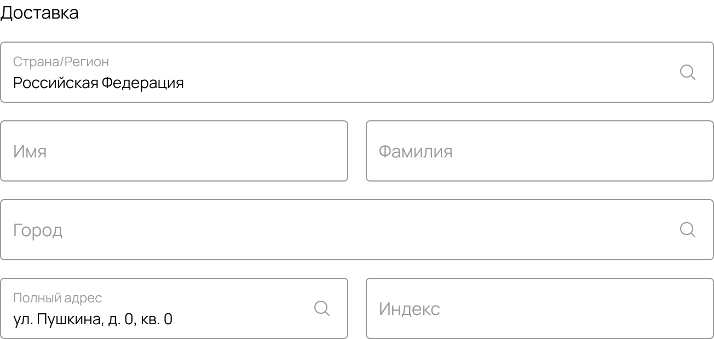

# 03 — CheckoutDeliveryForm

| | |
|---|---|
| **Figma node** | `1:13474` |
| **Size** | 652×310 |
| **Source of truth** | `packages/theme-base/blocks/CheckoutDeliveryForm/` |
| **Status** | ⏳ pending |
| **Last review** | — |

## Side-by-side

| Figma | Live |
|---|---|
|  | _capture pending_ |

## Figma tokens

См. `docs/checkout-parity/figma-tokens/CheckoutDeliveryForm.json` (auto-generated).

## Gaps

_TODO: заполнить при ревизии блока_

## Fix plan

_TODO_

## Fix log

_pending_
